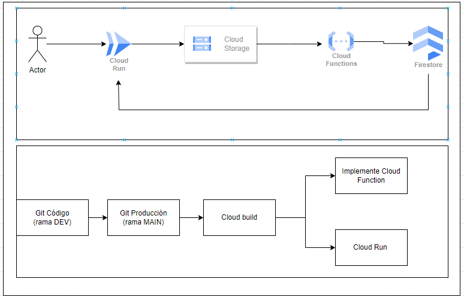

# GCP - Ejercicio Completo

Este repositorio contiene una app en Python y Flask, así como la lógica de una cloud function para traladar código 
de un Cloud Storaga a un Firestore. 

El documento contiene una carpeta llamada Cloud_Run, donde estará la app a desplegar. 

La app se desplegará a través de un contenedor que será creado a través de fichero [DockerFile](cloud_run/Dockerfile)

Por otro lado, tenemos un fichero [cloudbuild_run.yml](cloudbuild_run.yml) que despliega en Cloud Run y a través de Cloud
Build la app correspondiente. 

El fichero [cloudbuild_function.yaml](cloudbuild_function.yaml) contiene todo lo relacionado con la función que se activa 
solo en el momento que llega algún nuevo .json al bucket de Storage. 

